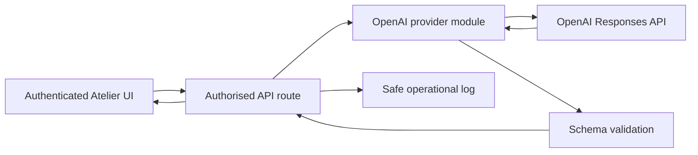

# API Provider Drift Corrective Action Plan

**Status:** Reviewed and ready for execution  
**Incident:** OpenAI migration left production routes on an unconfigured Anthropic provider  
**Prepared:** 9 October 2026  
**Production application:** `atelier-sales-preview` (`prj_SYLwZGYtiQQryVAMB5n0aAUALEnj`)  
**Production URL:** https://atelier-sales-preview.vercel.app  
**Release branch:** `fix/lusha-critical`

## Outcome

After this plan is complete, every AI-backed production workflow uses one supported OpenAI integration, required configuration is validated before deployment, the repository identifies the exact production project, provider failures are visible to users and operators, and a release cannot pass without exercising every provider boundary.

This work closes the recurring class of failure in which application code, runtime secrets, deployment identity, tests and handover documentation disagree about the active provider.

## Scope

### Included

- Migrate the five remaining Anthropic-backed routes:
  - `POST /api/suggestions`
  - `POST /api/trend-matching`
  - `GET /api/market-pulse`
  - `POST /api/pitch-angle`
  - `POST /api/outreach-timing`
- Revalidate the three already-migrated routes and all nine provider operations:
  - `POST /api/email` — email draft and `pitch_only` text generation
  - `POST /api/research`
  - `POST /api/competitor-signals`
- Consolidate all OpenAI calls behind one server-side provider module.
- Remove the Anthropic SDK and all Anthropic environment-variable references.
- Define and enforce the production environment contract.
- Pin and validate the canonical Vercel project before deployment.
- Show actionable errors for all provider-backed user actions.
- Add unit, route-contract, static-policy, preview smoke and production canary checks.
- Correct README, handover and prompt documentation.
- Contain and rotate credentials that were exposed during maintenance before provider smoke testing.

### Excluded

- New sales-intelligence functionality.
- Prompt redesign beyond changes required for provider compatibility, structured output and source handling.
- Copper integration.
- Reworking existing ICP scoring rules.
- General resolution of the repository's pre-existing lint backlog.

## Current state and risks

| Boundary | Current state | Risk |
|---|---|---|
| Email drafting | OpenAI Responses API | Working and tested |
| Brand research | OpenAI Responses API with web search | Working and tested |
| Industry Signals | OpenAI Responses API with web search | Working and tested |
| Suggestions | Anthropic SDK | Broken when invoked in production |
| Trend matching | Anthropic Messages API with web search | Broken when invoked in production |
| Market Pulse | Anthropic Messages API with web search | Broken when invoked in production |
| Pitch angles | Anthropic Messages API | Broken when invoked in production |
| Outreach timing | Anthropic Messages API with web search | Broken when invoked in production |
| Production environment | OpenAI configured; Anthropic absent | Correct target state, incompatible with remaining code |
| Local Vercel link | Corrected to `atelier-sales-preview` | The project identity is ignored by Git and can drift again |
| README and handover docs | Refer to Anthropic and `atelier-three-chi` | Operators can configure or deploy the wrong system |
| Frontend failures | Several actions log errors only to the console | Users see empty or reset states instead of a diagnosis |

The complete AI surface is eight routes and nine provider operations because `/api/email` supports both structured email generation and plain-text `pitch_only` generation.

## Architecture decision

Use the OpenAI Responses API for every AI workflow. Put authentication, model selection, safe error handling, usage reporting, structured output and optional web search in a single server-only module.



The provider module must expose three explicit operations:

1. `generateStructured()` for deterministic JSON responses without web search.
2. `researchStructured()` for JSON responses requiring OpenAI web search and source URLs.
3. `generateText()` for the existing `pitch_only` contract where plain text is the intended response.

Routes own their domain prompts and schemas. The provider module owns transport, secrets, model selection, timeouts, safe errors and response parsing. No route may call an AI vendor URL or read an AI vendor key directly.

## Execution plan

### Phase 0 — Freeze the contract and inventory

1. Confirm the live Vercel Git connection, production branch, automatic-deployment behavior and current alias ownership. Record the findings before changing release automation.
2. Establish a writable, company-controlled canonical repository. The recommended immediate source is `roryatelier/atelier-sales-tool`; transfer it to an Atelier-owned organisation when available. Protect its production branch and require CI plus Preview verification before merge.
3. Record the canonical production identity in a committed machine-readable file such as `config/deployment.json`:
   - Vercel team: `rory-ateliercos-projects`
   - Vercel organisation ID: `team_slGSsT6KwbJfJp4GO1gR4878`
   - project name: `atelier-sales-preview`
   - project ID: `prj_SYLwZGYtiQQryVAMB5n0aAUALEnj`
   - production alias: `atelier-sales-preview.vercel.app`
4. Add `config/env.schema.json` or an equivalent typed manifest containing required variable names, environments and validation rules. Never place secret values in the repository.
5. Inventory every `process.env` read and every outbound provider URL. Reconcile the inventory against the manifest.
6. Capture existing request and response contracts for all eight AI routes and nine operations so the UI can remain compatible during migration.
7. Contain exposed OpenAI, Lusha and Copper credentials immediately. Rotate them in provider consoles, update Preview and Production secrets, revoke the old values, and run all subsequent verification against the replacements. Do not place replacement values in chat, Git, logs or fixtures.

**Gate:** The inventory accounts for all eight routes and nine operations, the policy test correctly identifies every current direct-provider dependency, and narrow historical/test-fixture exceptions are documented. Full shared-provider enforcement becomes mandatory after Phase 2 because domain helpers such as `researchBrand()` may legitimately call the provider indirectly.

### Phase 1 — Consolidate the OpenAI provider

1. Merge the duplicated transport logic in `lib/openai-email.ts` and `lib/openai-research.ts` into a server-only module, for example `lib/openai.ts`.
2. Support:
   - `OPENAI_API_KEY`, required and non-empty.
   - `OPENAI_MODEL`, with one reviewed default.
   - A 20-second per-attempt cap and 40-second total action deadline for non-search generation.
   - A 40-second per-attempt cap and 60-second total action deadline for web research.
   - Cancellation using `AbortSignal.timeout`, with all retries included inside the total action deadline.
   - Structured JSON schemas with strict output.
   - Optional `web_search` with explicit tool choice.
   - Usage-token reporting.
   - Safe errors that expose provider, status category and retryability without response bodies or secrets.
3. Define stable error codes:
   - `provider_configuration`
   - `provider_authentication`
   - `provider_rate_limit`
   - `provider_timeout`
   - `provider_response_invalid`
   - `provider_unavailable`
4. Map upstream 401/403, 429 and 5xx/timeout responses to appropriate application HTTP statuses and error codes.
5. Keep web-derived source URLs in explicit schema fields. Validate that displayed links use only `http:` or `https:`.
6. Validate parsed results at runtime before business logic or persistence. A TypeScript cast is not validation. Use a lightweight schema validator or an explicit validator derived from the same domain schema.
7. Use one retry layer in the shared provider: at most one retry for 429 or transient 5xx responses when the operation is safe, with bounded backoff inside the total deadline. Never retry missing configuration, 401/403, invalid schema, refusal or timeout exhaustion.
8. Set explicit attempt budgets:
   - Standard structured/text action: one initial call plus at most one transient retry, within its total action deadline.
   - Email drafting: at most two total provider calls including trust-gate regeneration; transport retry is disabled once the regeneration budget is needed.
   - Pitch angles: three initial calls with concurrency capped at three, plus at most one retry total for failed roles; four calls maximum.
   - No nested provider retries. Cap output tokens and web-search context per operation.
   - Configure the Vercel function duration to at least 90 seconds and test cancellation before the platform deadline.
9. Preserve `OPENAI_EMAIL_MODEL` and `OPENAI_RESEARCH_MODEL` as temporary compatibility overrides during migration. Introduce `OPENAI_MODEL` only after a reviewed precedence rule and tests prevent a working route from silently changing models.

**Gate:** Provider unit tests cover missing configuration, successful structured and text output, required web search, valid JSON with the wrong shape, malformed or truncated output, refusal, empty output, invalid source URL, cancellation, retry counts, timeout, 401/403, 429 and 5xx responses without leaking provider content.

### Phase 2 — Migrate the remaining routes

Migrate one route at a time while preserving its existing API contract.

| Route | OpenAI operation | Required acceptance result |
|---|---|---|
| Suggestions | `generateStructured()` | Eight unique suggestions; exclusions honoured; re-engagement rows preserved |
| Trend matching | `researchStructured()` | Four to six matches against supplied brands with current sources |
| `GET /api/market-pulse` | `researchStructured()` | Current supply-chain signals with source, urgency and outreach angle |
| Pitch angles | `generateStructured()` | Three role-specific outputs plus recommended role; bounded concurrency |
| Outreach timing | `researchStructured()` | Recent-news result or explicit no-news result; deterministic fallback timing retained |

For each route:

1. Add a strict schema and TypeScript result type.
2. Validate inputs before any paid provider call.
3. Preserve authorisation before provider work.
4. Preserve deterministic business logic outside the model call.
5. Add request timeouts and bounded retry policy. Retry only safe transient failures and never authentication or schema failures.
6. Record token usage and route name without prompt bodies, contact data or provider responses.
7. Add a route contract test with a synthetic provider response.
8. Enforce domain invariants after schema validation:
   - Suggestions are unique under `normaliseBrandName()` and exclude every requested brand.
   - Trend matches reference only brands supplied in the request fixture.
   - Pitch angles return exactly three bullets for each of three deterministically selected roles.
   - Recent-news output has consistent news/no-news fields, valid dates and source provenance.
   - Outreach timing distinguishes “research unavailable” from “no recent news”; deterministic timing may continue in degraded mode but must not claim that no news exists.

After all five routes pass, re-run contract tests for email drafting, `pitch_only`, Brand Search and Industry Signals. Then remove `@anthropic-ai/sdk` and prove executable application code and active configuration contain no `ANTHROPIC_API_KEY`, Anthropic SDK import, Claude model name or Anthropic API URL.

**Gate:** `rg`-based policy test returns no retired-provider references in application code, configuration, tests or active documentation.

### Phase 3 — Make failures visible and actionable

1. Add user-visible error state to:
   - Get AI suggestions
   - Market Pulse
   - Trending Now
   - Pitch angles
   - Outreach timing
   - Industry Signals
   - Brand Search
2. Use plain messages based on stable error codes, for example:
   - Configuration/authentication: “AI service configuration needs administrator attention.”
   - Rate limit: “AI service is busy. Try again shortly.”
   - Timeout/unavailable: “Research did not complete. Retry this request.”
3. Preserve the user's input and existing results after failure.
4. Provide a retry control without silently issuing repeated paid calls.
5. Emit a structured server log with route, error code, status and request ID. Exclude prompts, API keys, OAuth tokens, email bodies and provider response bodies.
6. Return one public error envelope from every AI route: `{ error: { code, message, request_id, retryable } }`. Keep application authentication failures distinct from upstream-provider authentication failures.
7. Update `logSafeError()` or introduce a structured safe logger so stable codes and request IDs are retained while provider messages and sensitive values remain discarded.
8. Cover automatic initial loads, refresh actions, the email composer and dashboard timing requests, not only explicit buttons.
9. Add a protected deployment diagnostic that reports provider configuration as booleans and never exposes values. It must require administrator or deployment-secret authentication and must not be a public health surface.

**Gate:** UI tests prove that each provider failure renders an alert, retains user state and permits one deliberate retry.

### Phase 4 — Enforce configuration and deployment identity

1. Add `scripts/check-env-contract.mjs` to validate required variables for the intended environment. Validate JWT length, parsed allowlist emails, URLs, service-account JSON shape, database identity, Sheet identity, OAuth identity and model overrides in addition to non-empty strings.
2. Add `scripts/check-deployment-target.mjs` to compare the linked Vercel project/team/alias with `config/deployment.json`.
3. Add scripts:
   - `npm run check:provider-policy`
   - `npm run check:env`
   - `npm run check:deployment-target`
   - `npm run verify:release`
4. `verify:release` must run build, focused tests, provider policy, `check:env` and deployment-target validation before a production deployment.
5. Treat Vercel's displayed variable name as insufficient evidence. Runtime or preview smoke tests must prove each integration can authenticate.
6. Define isolated Preview dependencies: Preview database, test Sheet, Preview OAuth callback/client and test accounts. A Preview deployment must not write to the production Sheet or database.
7. Controlled provider-failure injection is permitted only in isolated automated tests and must be unreachable by production callers.

**Gate:** A deployment from a checkout linked to `atelier` or any project other than the committed production ID fails before upload.

### Phase 5 — Add CI and release verification

Create a GitHub Actions workflow and make it a required protected-branch check. Preview validation occurs before merge; production promotion cannot rely on an optional local npm script.

The target release path is:

```text
feature branch -> pull request checks -> immutable Vercel Preview
               -> authenticated uncached Preview smoke approval
               -> protected fast-forward production-branch merge
               -> Production-target build from exact approved SHA
               -> alias and canary verification
```

If Vercel Git auto-deployment cannot enforce the Preview approval gate, disable automatic production promotion and deploy through the protected workflow using the committed organisation/project IDs. Direct CLI deployment must run the same target and environment checks.

The Preview artifact itself is never promoted to Production because it contains Preview database, Sheet and OAuth configuration. Production creates a new Production-target build from the exact approved source SHA, validates Production configuration and only then assigns the production alias. Prefer a fast-forward/linear merge that preserves the approved SHA. If the merge mechanism creates a new commit SHA, create a new Preview from that SHA and rerun the required checks before building Production.

#### Pull-request checks

- Install from the lockfile.
- Build and TypeScript check.
- Security, email, research, Lusha and new provider-route tests.
- Provider-policy scan.
- Environment-manifest schema validation without requiring real secrets.
- Documentation check for retired project/provider identifiers in the active documentation set. Historical incident evidence is explicitly excluded.

#### Preview checks

Run authenticated smoke tests against the Vercel preview using test credentials and a test database or isolated test records:

1. Brand Search performs an explicitly uncached provider call and returns a structured dossier.
2. Industry Signals returns sourced results.
3. Suggestions return eight unique brands.
4. Market Pulse returns sourced results.
5. Trend matching returns matches for a fixture pipeline.
6. Pitch angles return three roles.
7. Outreach timing returns a valid timing response.
8. Lusha free search path returns real-provider pagination without paid reveal.
9. The email API returns subject and body from an uncached provider call.
10. The email UI separately proves the selected recipient remains attached to the generated draft.
11. Email `pitch_only` returns the expected plain-text contract.
12. Provider failures surface visibly using a controlled failure mode.

Tests must use unique run IDs and clean up only their own records. For Brand Search, a unique run ID alone is insufficient because the cache key is the normalised brand name: use an isolated Preview database or a known absent brand, record safe request-ID evidence of a provider invocation, and never delete a shared production dossier. Test both cache-hit compatibility and cache-miss authentication. Start dashboard checks with fresh account-scoped browser storage or use the explicit Refresh path so browser caches cannot create false positives.

#### Production canary

After deployment, run one bounded canary per critical provider boundary. Use an uncached or explicitly refreshed input, avoid paid Lusha reveals and avoid sending an email unless the release specifically changes delivery. Verify HTTP result, user-visible output and safe request-ID evidence of a provider call. Query deployment logs for error codes after the canary.

**Gate:** Production is shareable only after deployment status is Ready, all canaries pass, logs show no new errors, and commit SHA, organisation ID, project ID, deployment ID, target environment and resolved production alias are recorded together.

### Phase 6 — Correct documentation and operating ownership

Update:

- `README.md`
- `doc/HANDOVER.md`
- `doc/TECHNICAL_HANDOOFF.md`
- `doc/PROMPTS.md`

Required corrections:

- OpenAI is the sole AI provider.
- Production project and URL identify `atelier-sales-preview` only.
- Environment reference is generated from or checked against the manifest.
- Key rotation requires Preview and Production updates plus redeployment and canary verification.
- Adding users requires `APP_ALLOWED_EMAILS`; access is not open to every Google account.
- Google Sheet and OAuth project references match the active production configuration.
- The release checklist records branch, commit, deployment ID, test evidence and rollback target.
- Documentation changes are part of the candidate commit tested in Preview; documentation is not edited between Preview approval and production promotion.

Assign one named maintainer for application code and one named administrator for Vercel/provider credentials. Record their roles, not secret values, in the handover document.

**Gate:** CI fails when active operator documentation or executable configuration contains `atelier-three-chi`, retired-provider configuration or claims that any Google user can access production. This corrective-action plan and archived incident evidence are explicit historical exceptions.

## Test matrix

| Layer | Test | Failure prevented |
|---|---|---|
| Static | Retired-provider scan | Partial migrations |
| Unit | Provider transport and error mapping | Silent auth, timeout and parsing failures |
| Route contract | Eight AI routes and nine provider operations | Request/response drift |
| Security | Authorisation before provider work | Unauthorised paid calls |
| UI | Alert, state retention and retry | “Button does nothing” reports |
| Environment | Required, non-empty variable contract | Missing runtime configuration |
| Deployment | Exact project/team/alias assertion | Secrets read from or deployed to the wrong project |
| Preview smoke | Uncached real-provider authentication plus cache-hit compatibility | Mocks or stale caches passing with invalid credentials |
| Production canary | User-visible output plus logs | Ready deployment with broken integration |

## Rollout sequence

1. Confirm live deployment settings and canonical repository ownership; contain exposed credentials.
2. Commit provider consolidation, all route migrations, UI errors, tests, deployment checks and corrected documentation on one feature branch.
3. Deploy the exact candidate commit to the isolated Vercel Preview environment before merge.
4. Run the complete uncached Preview smoke matrix and inspect logs after the credential rotation.
5. Prepare and verify a rollback source SHA compatible with the current secrets. Create a non-aliased Production-target build from that SHA, validate its Production configuration and protected diagnostic, and record its deployment ID. The rollback may explicitly disable affected AI actions but must preserve authentication, email delivery, pipeline and Lusha functionality.
6. Approve and merge through the protected production branch only after Preview evidence is attached.
7. Build the exact reviewed commit for the Production target, validate its Production environment contract, assign the `atelier-sales-preview` alias and verify the alias resolves to its deployment ID.
8. Run the production canary matrix and inspect logs.
9. Monitor structured provider error codes for one business day. Trigger rollback on any provider-authentication error, sustained error rate above 5% for 15 minutes, or two consecutive failures of the same production canary.
10. Close the incident after the monitoring window remains clean and the application and credential owners sign off.

## Rollback

- Record the last known-good deployment ID immediately before release, but do not assume it is compatible with current secrets.
- Build and Preview-test a rollback candidate that uses current secrets and either preserves the migrated OpenAI paths or deliberately disables the affected AI actions with a visible maintenance message. Also create and validate a non-aliased Production-target build so rollback does not reuse Preview configuration.
- If authentication, schema parsing or latency degrades, promote the verified rollback candidate rather than blindly restoring an Anthropic-dependent alias.
- Do not restore Anthropic credentials or reactivate retired provider code as rollback.
- Preserve failed request metadata without prompts or personal data for diagnosis.
- Correct forward in Preview, rerun all gates and deploy a new immutable production build.

## Definition of done

- All eight AI routes and nine provider operations use the shared OpenAI provider.
- No active code, dependency, environment manifest or operating document references Anthropic.
- The correct Vercel project is enforced by a machine-readable check.
- Required secrets are non-empty in Preview and Production and proven through smoke tests.
- Every provider-backed action has a visible, actionable failure state.
- Build, security, provider, route-contract and UI tests pass.
- Preview smoke and production canary matrices pass.
- Exposed credentials have been rotated and the prior credentials are revoked.
- README and all handover documents describe the live system.
- The release evidence records commit, deployment, canary results, log review and rollback target.

## Implementation lanes and dependencies

| Lane | Work | Dependency |
|---|---|---|
| A | Canonical repo, live Vercel settings, credential containment, environment/deployment manifests | Starts first; blocks release automation and real-provider tests |
| B | Shared OpenAI provider, runtime validators, error envelope, safe logging | Depends on route-contract inventory |
| C | Five route migrations and revalidation of email/research/industry operations | Depends on Lane B; routes can be implemented in parallel if schemas stay route-local |
| D | UI failure states and retry controls | Depends on public error envelope from Lane B |
| E | Static policy, unit/contract/UI tests, CI and deployment workflow | Starts with manifests; final gates depend on B–D |
| F | Active docs, Preview smoke, rollback candidate, production canary | Docs can start early; smoke and rollback depend on the exact candidate from B–E |

Provider-module changes remain sequential in one lane to avoid competing transport abstractions. Route schema work may run in parallel, but integration, lockfile removal and policy scans happen only after all route branches converge.

## Adversarial review incorporated

An independent delegated review initially returned **no-go** for the first draft. The following recommendations were accepted and folded into this version:

- Corrected the inventory to eight AI routes and nine provider operations.
- Corrected Market Pulse from POST to GET and added `pitch_only` coverage.
- Made Preview verification precede protected merge and made production promotion an enforced workflow.
- Added uncached provider-call evidence so database and browser caches cannot produce false-positive smoke results.
- Moved exposed-credential containment to the start of execution.
- Replaced blind alias rollback with a current-secret-compatible rollback build.
- Added runtime domain validation, degraded research state and complete public error-envelope propagation.
- Added explicit timeouts, retries, concurrency, model-override and cost-control decisions.
- Scoped retired-provider policy checks so historical evidence and negative fixtures do not make the policy self-defeating.
- Added Preview data, Sheet and OAuth isolation plus exact deployment evidence.
- Required separate Preview and Production builds from the approved source SHA so environment-specific configuration cannot cross targets.
- Reconciled retry, trust-gate and fan-out budgets under total action deadlines and a verified Vercel function limit.

**Verified review outcome:** Go for implementation. Production release remains conditional on exact-SHA Production artifact handling and every recorded gate passing.

## Release evidence template

```text
Commit:
Pull request:
Preview deployment:
Production deployment:
Previous production deployment / rollback target:
Rollback candidate deployment:
Organisation ID:
Project ID:
Target environment:
Resolved alias deployment ID:
Provider-policy check:
Environment-contract check:
Deployment-target check:
Automated test summary:
Preview smoke summary:
Production canary summary:
Post-deploy log review:
Credential rotation confirmed by:
Application maintainer sign-off:
Credential administrator sign-off:
```
